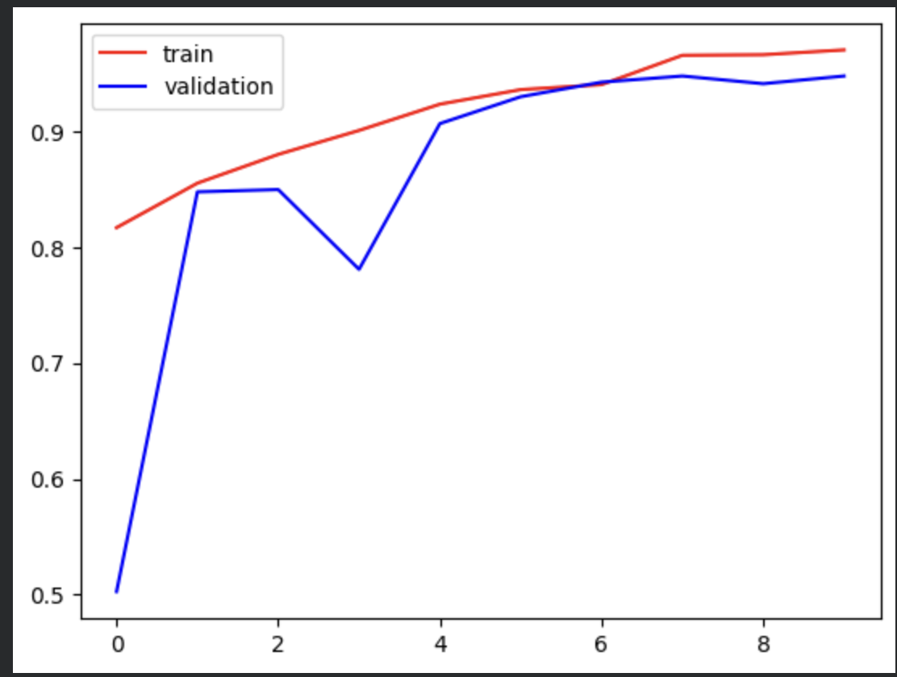
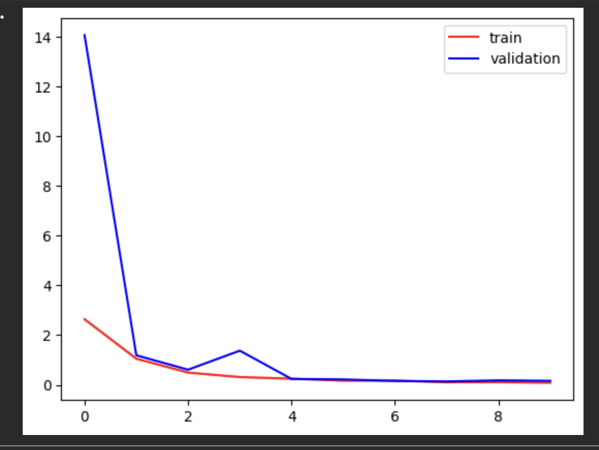

# CNN Face Mask/No-Mask Classifier

A convolutional neural network (CNN) model for binary classification of face images: detecting whether a person is wearing a mask or not.

## Overview

- **Input**: Face images or camera feed frames
- **Output**: Binary classification - `mask` (1) or `no-mask` (0)
- **Architecture**: 3-layer CNN with Conv2D, MaxPooling2D, and Dense layers
- **Framework**: TensorFlow/Keras
- **Dataset**: [Face Mask Dataset from Kaggle](https://www.kaggle.com/datasets/omkargurav/face-mask-dataset?utm_source=chatgpt.com)

## Model Information

The trained model is available in two formats:
- `Mask_Detector_Model.h5` - Keras H5 format
- `Mask_Detector_Model.keras` - Keras native format

### Model Performance

The model was trained for 10 epochs with a 80-20 train-validation split on 256x256 resized images.

**Training Results:**

| Metric | Details |
|--------|---------|
| **Accuracy** |  |
| **Loss** |  |

## Files

- `main.ipynb` - Complete training and inference notebook
- `requirement.txt` - Python dependencies
- `Mask_Detector_Model.h5` - Pre-trained model (H5 format)
- `Mask_Detector_Model.keras` - Pre-trained model (Keras format)
- `train_validation_accuracy.png` - Accuracy visualization
- `train_validation_loss.png` - Loss visualization

## Installation

1. Clone the repository:
```bash
git clone "https://github.com/sphinx78/CNN_mask_nomask_classifier.git"
cd CNN_mask_nomask_classifier
```

2. Create a Python environment:
```bash
python3 -m venv venv
source venv/bin/activate
```

3. Install required packages:
```bash
pip install -r requirement.txt
```

## Usage

### Loading and Using the Pre-trained Model

```python
import tensorflow as tf
from tensorflow import keras
import cv2

# Load the model
model = keras.models.load_model('Mask_Detector_Model.keras')

# Load and preprocess an image
image = cv2.imread('path/to/image.jpg')
image = cv2.resize(image, (256, 256))
image = image.reshape((1, 256, 256, 3))

# Make prediction
prediction = model.predict(image)
label = "Mask" if prediction[0] < 0.5 else "No Mask"
print(f"Prediction: {label}")
```

## Training Details

The CNN architecture consists of:
- **Input Layer**: 256x256x3 (RGB images)
- **3 Conv2D Blocks**: Each with 32, 64, and 128 filters respectively
- **MaxPooling2D Layers**: Pool size (2,2) for feature extraction
- **Flatten Layer**: Convert 2D features to 1D
- **Dense Layers**: 128 neurons, 64 neurons, and 1 output neuron with sigmoid activation
- **Loss Function**: Binary Crossentropy
- **Optimizer**: Adam
- **Batch Size**: 32

## Dataset

The dataset used for training this model is sourced from:
[**Face Mask Dataset** on Kaggle](https://www.kaggle.com/datasets/omkargurav/face-mask-dataset?utm_source=chatgpt.com)

The dataset contains labeled images of faces with and without masks, split into two classes:
- `mask` - Images of people wearing masks
- `no_mask` - Images of people without masks

## Requirements

See `requirement.txt` for complete dependencies:
- TensorFlow >= 2.12.0
- Keras >= 2.12.0
- OpenCV (cv2) >= 4.8.0
- Matplotlib >= 3.7.0
- NumPy >= 1.23.0
- Pillow >= 9.5.0

## License

This project uses the Face Mask Dataset from Kaggle under its respective license terms.

## Notes

- A balanced dataset helps improve classifier reliability.
- Data augmentation can reduce overfitting.
- Use transfer learning from a pretrained CNN if dataset size is limited.
